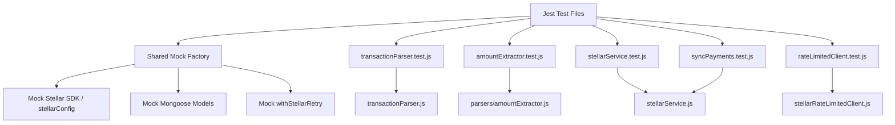

# Design Document: blockchain-testing

## Overview

This document describes the design for a comprehensive test suite covering the blockchain integration layer of StellarEduPay. The system interacts with the Stellar Horizon API to process school fee payments. Because live Horizon calls are not viable in unit tests, the suite relies on a shared Jest mock infrastructure that replaces the SDK, Mongoose models, and utility wrappers with configurable fakes.

The test suite targets five modules:
- `transactionParser.js` — parses raw Stellar transactions into structured payment data
- `parsers/amountExtractor.js` — normalizes amounts and filters payment operations
- `parsers/memoExtractor.js` — decodes memo fields from all Stellar memo types
- `stellarService.js` — verifies transactions and syncs payments for a school
- `stellarRateLimitedClient.js` — wraps Horizon calls with throttling, queuing, and retry

---

## Architecture

The test suite is organized as a set of Jest test files under `tests/blockchain/`. A shared mock factory (`tests/blockchain/__mocks__/`) provides reusable mock builders for the Stellar SDK, Mongoose models, and utility helpers.



Jest's module mocking (`jest.mock(...)`) intercepts `require` calls so the modules under test never reach the real Horizon API or MongoDB.

---

## Components and Interfaces

### Shared Mock Factory

**Location:** `tests/blockchain/__mocks__/stellarMocks.js`

Provides builder functions that return pre-configured Jest mock objects:

```js
// Returns a mock server with chainable Horizon-style builders
function buildMockServer(overrides = {}) { ... }

// Returns a mock tx object with configurable operations() response
function buildMockTransaction(overrides = {}) { ... }

// Returns a mock payment operation
function buildMockPaymentOp(overrides = {}) { ... }

// Returns mock Mongoose model with jest.fn() stubs
function buildMockModel(defaults = {}) { ... }
```

The mock server exposes:
- `transactions()` → chainable builder with `.transaction(hash).call()`, `.forAccount(key).order().limit().call()`
- `ledgers()` → chainable builder with `.order().limit().call()`, `.ledger(seq).call()`
- `loadAccount(key)` → returns a mock account object

`isAcceptedAsset` is mocked to accept `XLM` (native) and `USDC` (credit_alphanum4) only.

`withStellarRetry` is mocked to call `fn()` directly with no delay.

### Test Files

| File | Module Under Test | Focus |
|---|---|---|
| `transactionParser.test.js` | `transactionParser.js` | Parsing, validation, error codes |
| `amountExtractor.test.js` | `parsers/amountExtractor.js` | Normalization, operation filtering |
| `stellarService.test.js` | `stellarService.js` (verifyTransaction, validatePaymentAgainstFee) | Fee validation, error paths |
| `rateLimitedClient.test.js` | `stellarRateLimitedClient.js` | Throttling, retry, stats |
| `syncPayments.test.js` | `stellarService.js` (syncPaymentsForSchool) | End-to-end sync flow |

---

## Data Models

### MockTransaction

```js
{
  hash: string,           // e.g. "abc123..."
  successful: boolean,
  memo: string | null,
  memo_type: string,      // "text" | "id" | "hash" | "return" | "none"
  created_at: string,     // ISO 8601
  fee_paid: string,       // stroops as string, e.g. "100"
  ledger_attr: number,
  operations: () => Promise<{ records: MockOperation[] }>
}
```

### MockOperation

```js
{
  type: "payment" | "path_payment_strict_receive" | "path_payment_strict_send",
  from: string,
  to: string,
  amount: string,         // e.g. "100.0000000"
  asset_type: "native" | "credit_alphanum4",
  asset_code: string | undefined,
  asset_issuer: string | null,
  source_amount: string | undefined,
  source_asset_type: string | undefined
}
```

### ParsedTransaction (output of `transactionParser.parseTransaction`)

```js
{
  hash: string,
  successful: boolean,
  memo: string | null,
  memoType: string | null,
  operations: PaymentOperation[],
  ledger: number | null,
  createdAt: string,
  networkFee: number,
  senderAddress: string | null,
  metadata: { parserVersion, parsedAt, processingTimeMs }
}
```

### PaymentOperation (output of `amountExtractor.extractPaymentOperations`)

```js
{
  type: string,
  amount: number,         // normalized to 7 decimal places
  asset: { code, type, issuer, displayName, decimals },
  from: string | null,
  to: string,
  sourceAmount: number | null,
  sourceAsset: object | null
}
```

---

## Correctness Properties

*A property is a characteristic or behavior that should hold true across all valid executions of a system — essentially, a formal statement about what the system should do. Properties serve as the bridge between human-readable specifications and machine-verifiable correctness guarantees.*

### Property 1: Parse-then-validate round trip

*For any* valid Stellar transaction object (successful, with memo and a payment operation to the target wallet), parsing it with `parseTransaction` and then passing the result to `validateParsedData` SHALL produce `{ valid: true }`.

**Validates: Requirements 2.7**

---

### Property 2: normalizeAmount idempotence

*For any* valid raw amount string, applying `normalizeAmount` twice SHALL produce the same result as applying it once: `normalizeAmount(normalizeAmount(x)) === normalizeAmount(x)`.

**Validates: Requirements 3.8**

---

### Property 3: validatePaymentAgainstFee exact-match invariant

*For any* positive fee amount `f`, `validatePaymentAgainstFee(f, f).status` SHALL equal `'valid'`.

**Validates: Requirements 5.4**

---

### Property 4: overpaid excess amount is always positive

*For any* inputs where `validatePaymentAgainstFee` returns `status: 'overpaid'`, the `excessAmount` field SHALL be strictly greater than `0`.

**Validates: Requirements 5.5**

---

### Property 5: operation filtering excludes wrong-destination payments

*For any* operations array containing payment operations, `extractPaymentOperations` SHALL only return operations whose `to` field equals the target wallet address.

**Validates: Requirements 3.4**

---

## Error Handling

| Scenario | Module | Error Code | Behavior |
|---|---|---|---|
| `null` or missing `hash` in transaction | TransactionParser | `INVALID_TRANSACTION` | Throws `TransactionParseError` |
| `successful: false` on transaction | TransactionParser | `TRANSACTION_FAILED` | Throws `TransactionParseError` |
| No payment operation to school wallet | StellarService | `INVALID_DESTINATION` | Throws with `code: 'INVALID_DESTINATION'` |
| Unsupported asset in payment op | StellarService | `UNSUPPORTED_ASSET` | Throws with `code: 'UNSUPPORTED_ASSET'` |
| Amount below minimum payment limit | StellarService | `AMOUNT_TOO_LOW` | Throws with payment-limit error code |
| HTTP 429 from Horizon | RateLimitedClient | `RATE_LIMIT_ERROR` | Retries up to `RETRY_MAX_ATTEMPTS`, then throws `StellarAPIError` |
| HTTP 400 from Horizon | RateLimitedClient | `VALIDATION_ERROR` | Throws immediately, no retry |
| HTTP 5xx from Horizon | RateLimitedClient | `SERVER_ERROR` | Retries, then throws `StellarAPIError` |
| Queue at `HIGH_WATER` limit | RateLimitedClient | `RATE_LIMIT_ERROR` | Throws `StellarAPIError` with status 429 |
| Non-positive amount in parsed operation | validateParsedData | `INVALID_AMOUNT` | Returns `{ valid: false, errors: [{ code: 'INVALID_AMOUNT' }] }` |
| No payment operations in parsed result | validateParsedData | `NO_PAYMENT_OPERATIONS` | Returns `{ valid: false, errors: [{ code: 'NO_PAYMENT_OPERATIONS' }] }` |

All mock-level errors are thrown as plain `Error` objects with a `code` property, matching the production service contract.

---

## Testing Strategy

### Framework and Libraries

- **Test runner:** Jest 29 (already in `devDependencies`)
- **Property-based testing:** `fast-check` — a mature PBT library for JavaScript/TypeScript with excellent Jest integration
- **Mocking:** Jest built-in (`jest.mock`, `jest.fn`, `jest.spyOn`)

Install fast-check:
```bash
npm install --save-dev fast-check
```

### Dual Testing Approach

**Unit tests** cover:
- Specific happy-path examples (valid transaction, correct fee, etc.)
- Specific error-path examples (missing memo, wrong destination, etc.)
- Edge cases (null amounts, empty operations array, unknown student)
- Integration between mock layers and service functions

**Property-based tests** cover:
- Universal properties that must hold for all valid inputs (see Correctness Properties section)
- Each property test runs a minimum of **100 iterations** via fast-check's `fc.assert(fc.property(...), { numRuns: 100 })`

### Property Test Configuration

Each property test MUST include a comment tag in this format:

```
// Feature: blockchain-testing, Property N: <property text>
```

Each correctness property is implemented by exactly one property-based test.

### Test File Structure

```
tests/
  blockchain/
    __mocks__/
      stellarMocks.js       ← shared mock builders
    transactionParser.test.js
    amountExtractor.test.js
    stellarService.test.js
    rateLimitedClient.test.js
    syncPayments.test.js
```

### Mock Reset Strategy

Every test file uses `beforeEach(() => jest.clearAllMocks())` to reset mock call counts and return values between tests. Stateful mocks (e.g., `Payment.findOne` return values) are reconfigured per test using `mockResolvedValueOnce` or `mockReturnValueOnce`.

### Unit Test Balance

Unit tests focus on concrete examples and error conditions. Property tests handle broad input coverage. Avoid duplicating coverage — if a property test already covers a range of inputs, a unit test for the same range is unnecessary. Unit tests should be written for:
- The specific examples in the acceptance criteria (exact fee match, exact error codes)
- Edge cases called out in requirements (null amount → 0, empty array → empty array)
- Integration points (mock wiring, module boundary behavior)

### Running Tests

```bash
# Single run (no watch mode)
cd backend && npx jest tests/blockchain --runInBand --run
```
