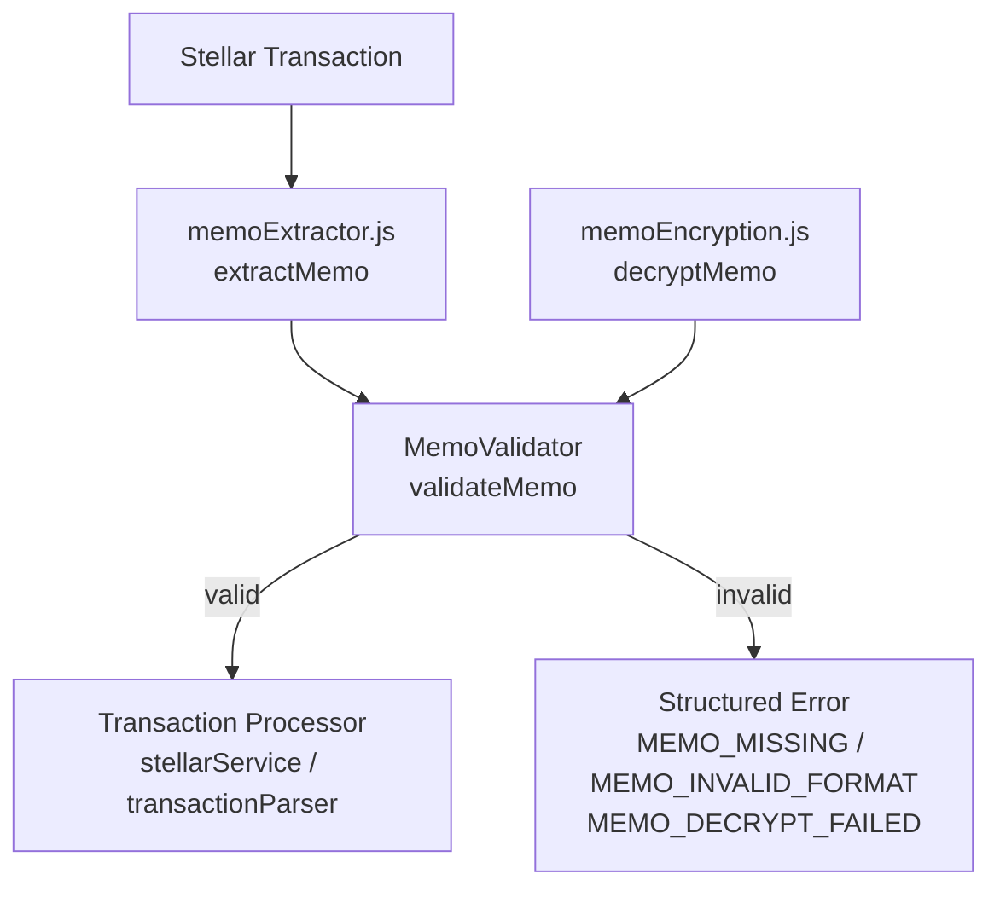

# Design Document: Memo Format Validation

## Overview

This feature introduces a canonical memo format (`STU-[A-Z0-9]{6}`) for student IDs embedded in Stellar transaction memos, and enforces validation of that format before any payment processing occurs.

Currently, `stellarService.js` and `transactionParser.js` extract memos from Stellar transactions but apply no structural validation beyond checking for presence. This means malformed or ambiguous memos can reach downstream payment logic. The fix is a dedicated `MemoValidator` module that becomes the single source of truth for memo format rules, integrated into both the transaction parser and the Stellar service.

The design is intentionally narrow: a pure utility module with no side effects, no database access, and no HTTP concerns. It slots into the existing pipeline at the earliest possible point.

---

## Architecture



The `MemoValidator` sits between memo extraction and transaction processing. When encryption is enabled, decryption happens inside the validator before format checking. No other component duplicates memo format logic.

---

## Components and Interfaces

### MemoValidator (`backend/src/utils/memoValidator.js`)

New module. Pure functions, no I/O.

```js
/**
 * Validate a raw memo string (plain or encrypted).
 * Returns { valid: true, studentId } or { valid: false, code, reason, value }.
 */
function validateMemo(rawMemo): ValidationResult

/**
 * Parse a raw memo into a structured object.
 * Throws MemoValidationError on failure.
 */
function parseMemo(raw): { studentId: string }

/**
 * Produce a canonical memo string from a student ID.
 * Throws if the input does not match STU-[A-Z0-9]{6}.
 */
function formatMemo(studentId): string
```

**Error codes:**

| Code | Condition |
|---|---|
| `MEMO_MISSING` | memo is null, undefined, or empty string |
| `MEMO_INVALID_FORMAT` | memo does not match `^STU-[A-Z0-9]{6}$` |
| `MEMO_DECRYPT_FAILED` | decryption was attempted but failed |

### Integration Points

- **`transactionParser.js` → `validateParsedData`**: After existing field checks, call `validateMemo(data.memo)`. On failure, push a structured error into the `errors` array using the validator's error code.
- **`stellarService.js` → `verifyTransaction`**: Replace the current `if (!memo)` guard with `validateMemo(rawMemo)`. On failure, throw with the validator's error code.
- **`stellarService.js` → `extractValidPayment`**: Same replacement for the early-return null guard.

No changes to `memoExtractor.js` or `memoEncryption.js` — those remain responsible for extraction and encryption respectively.

---

## Data Models

No new database models. The validator operates on strings and returns plain objects.

**`ValidationResult`** (returned by `validateMemo`):

```ts
// Success
{ valid: true; studentId: string }

// Failure
{ valid: false; code: 'MEMO_MISSING' | 'MEMO_INVALID_FORMAT' | 'MEMO_DECRYPT_FAILED'; reason: string; value: unknown }
```

**`ParsedMemo`** (returned by `parseMemo`):

```ts
{ studentId: string }
```

**`MemoValidationError`** (thrown by `parseMemo` / `formatMemo`):

```ts
class MemoValidationError extends Error {
  code: string;
  value: unknown;
}
```

---

## Correctness Properties

*A property is a characteristic or behavior that should hold true across all valid executions of a system — essentially, a formal statement about what the system should do. Properties serve as the bridge between human-readable specifications and machine-verifiable correctness guarantees.*

### Property 1: Only conforming memos are accepted

*For any* string, `validateMemo` returns `valid: true` if and only if the (possibly decrypted) content matches `^STU-[A-Z0-9]{6}$`.

**Validates: Requirements 1.1, 1.2, 1.3, 1.4**

---

### Property 2: Null and empty memos produce MEMO_MISSING

*For any* null, undefined, or empty (including whitespace-only) input, `validateMemo` returns `{ valid: false, code: 'MEMO_MISSING' }`.

**Validates: Requirements 1.2, 2.3**

---

### Property 3: Invalid-format memos produce MEMO_INVALID_FORMAT

*For any* non-empty string that does not match `^STU-[A-Z0-9]{6}$` (including lowercase, wrong prefix, wrong suffix length, extra characters), `validateMemo` returns `{ valid: false, code: 'MEMO_INVALID_FORMAT' }`.

**Validates: Requirements 1.3, 1.4, 2.4**

---

### Property 4: Round-trip integrity

*For any* valid student ID string matching `STU-[A-Z0-9]{6}`, calling `parseMemo(formatMemo(studentId))` returns an object whose `studentId` field equals the original input.

**Validates: Requirements 4.3**

---

### Property 5: formatMemo rejects invalid inputs

*For any* string that does not match `STU-[A-Z0-9]{6}`, calling `formatMemo` throws a `MemoValidationError`.

**Validates: Requirements 4.4**

---

### Property 6: Encrypted memo validation is transparent

*For any* valid student ID, when encryption is enabled, `validateMemo(encryptMemo(studentId))` returns `{ valid: true, studentId }` — the same result as validating the plaintext directly.

**Validates: Requirements 3.1, 3.3**

---

### Property 7: Failed decryption produces MEMO_DECRYPT_FAILED

*For any* string that looks like an encrypted payload but cannot be decrypted (wrong key, corrupted bytes), `validateMemo` returns `{ valid: false, code: 'MEMO_DECRYPT_FAILED' }`.

**Validates: Requirements 3.2**

---

### Property 8: Validation failure blocks processing

*For any* parsed transaction whose memo fails validation, `validateParsedData` includes an error with code `MEMO_MISSING` or `MEMO_INVALID_FORMAT` in the returned `errors` array, and the transaction is not processed further.

**Validates: Requirements 2.1, 2.2, 2.5, 5.1, 5.2**

---

## Error Handling

All errors from `MemoValidator` are structured and carry a `code` field. Callers must not swallow these errors silently.

| Caller | On `MEMO_MISSING` | On `MEMO_INVALID_FORMAT` | On `MEMO_DECRYPT_FAILED` |
|---|---|---|---|
| `validateParsedData` | push to `errors[]` | push to `errors[]` | push to `errors[]` |
| `verifyTransaction` | throw (existing `MISSING_MEMO` path) | throw | throw |
| `extractValidPayment` | return `null` | return `null` | return `null` |

The `PERMANENT_FAIL_CODES` array in `paymentController.js` already includes `MISSING_MEMO`. `MEMO_INVALID_FORMAT` and `MEMO_DECRYPT_FAILED` should be added to that list so they are not retried.

---

## Testing Strategy

### Unit Tests

Focus on concrete examples and edge cases:

- `validateMemo(null)` → `MEMO_MISSING`
- `validateMemo('')` → `MEMO_MISSING`
- `validateMemo('   ')` → `MEMO_MISSING`
- `validateMemo('STU-ABC123')` → `valid: true`
- `validateMemo('stu-abc123')` → `MEMO_INVALID_FORMAT` (lowercase)
- `validateMemo('STU-ABC12')` → `MEMO_INVALID_FORMAT` (5 chars)
- `validateMemo('STU-ABC1234')` → `MEMO_INVALID_FORMAT` (7 chars)
- `validateMemo('STU-ABC!23')` → `MEMO_INVALID_FORMAT` (special char)
- `parseMemo` / `formatMemo` round-trip with a known value
- `validateParsedData` with a memo-less transaction includes the right error code

### Property-Based Tests

Use [fast-check](https://github.com/dubzzz/fast-check) (already available in the JS ecosystem; add as a dev dependency if not present). Each property test runs a minimum of 100 iterations.

**Property 1 — Only conforming memos accepted**
```
// Feature: memo-format-validation, Property 1: only conforming memos are accepted
fc.assert(fc.property(
  fc.string(),
  (s) => {
    const result = validateMemo(s);
    const matches = /^STU-[A-Z0-9]{6}$/.test(s.trim());
    return result.valid === matches;
  }
), { numRuns: 100 });
```

**Property 2 — Null/empty → MEMO_MISSING**
```
// Feature: memo-format-validation, Property 2: null and empty memos produce MEMO_MISSING
fc.assert(fc.property(
  fc.constantFrom(null, undefined, '', '   ', '\t', '\n'),
  (s) => validateMemo(s).code === 'MEMO_MISSING'
), { numRuns: 100 });
```

**Property 3 — Invalid format → MEMO_INVALID_FORMAT**
```
// Feature: memo-format-validation, Property 3: invalid-format memos produce MEMO_INVALID_FORMAT
// Generator: non-empty strings that don't match the pattern
fc.assert(fc.property(
  fc.string({ minLength: 1 }).filter(s => !/^STU-[A-Z0-9]{6}$/.test(s.trim())),
  (s) => {
    const r = validateMemo(s);
    return !r.valid && (r.code === 'MEMO_INVALID_FORMAT' || r.code === 'MEMO_MISSING');
  }
), { numRuns: 100 });
```

**Property 4 — Round-trip integrity**
```
// Feature: memo-format-validation, Property 4: round-trip integrity
const validStudentId = fc.stringMatching(/^STU-[A-Z0-9]{6}$/);
fc.assert(fc.property(
  validStudentId,
  (id) => parseMemo(formatMemo(id)).studentId === id
), { numRuns: 100 });
```

**Property 5 — formatMemo rejects invalid inputs**
```
// Feature: memo-format-validation, Property 5: formatMemo rejects invalid inputs
fc.assert(fc.property(
  fc.string().filter(s => !/^STU-[A-Z0-9]{6}$/.test(s)),
  (s) => { try { formatMemo(s); return false; } catch { return true; } }
), { numRuns: 100 });
```

**Property 6 — Encrypted memo validation is transparent**
```
// Feature: memo-format-validation, Property 6: encrypted memo validation is transparent
// (run with MEMO_ENCRYPTION_KEY set)
fc.assert(fc.property(
  validStudentId,
  (id) => {
    const encrypted = encryptMemo(id);
    return validateMemo(encrypted).studentId === id;
  }
), { numRuns: 100 });
```

**Property 8 — Validation failure blocks processing**
```
// Feature: memo-format-validation, Property 8: validation failure blocks processing
fc.assert(fc.property(
  fc.string().filter(s => !/^STU-[A-Z0-9]{6}$/.test(s)),
  (badMemo) => {
    const result = validateParsedData({ hash: 'abc', memo: badMemo, operations: [{ amount: 1 }] });
    return result.errors.some(e => ['MEMO_MISSING', 'MEMO_INVALID_FORMAT', 'MEMO_DECRYPT_FAILED'].includes(e.code));
  }
), { numRuns: 100 });
```
